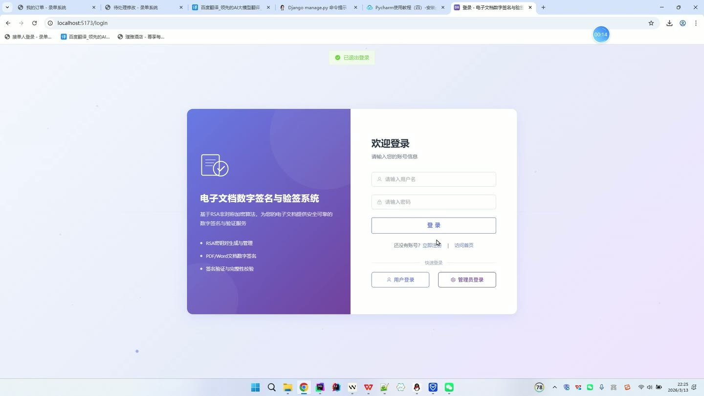
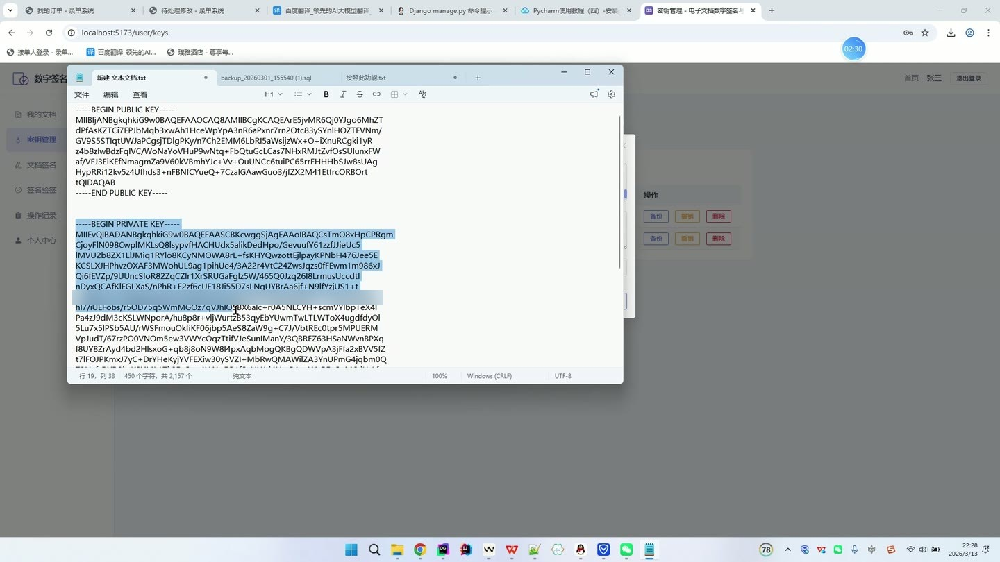
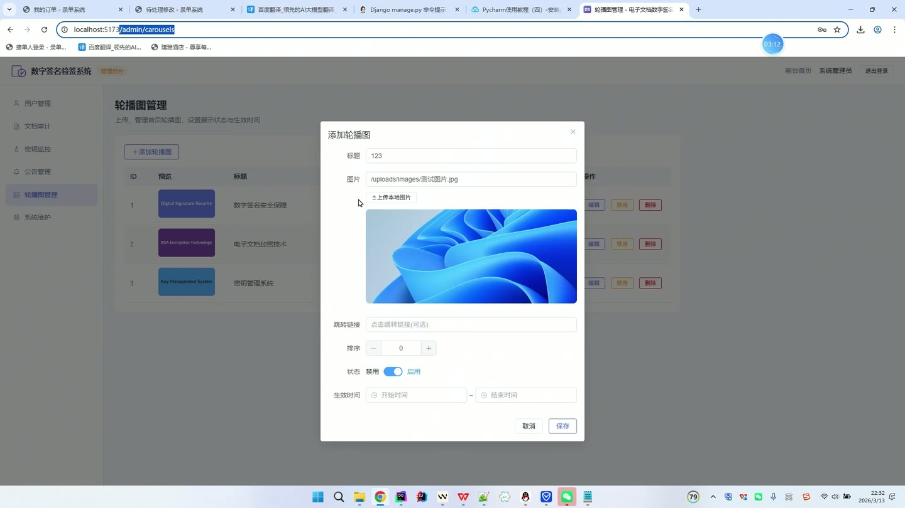
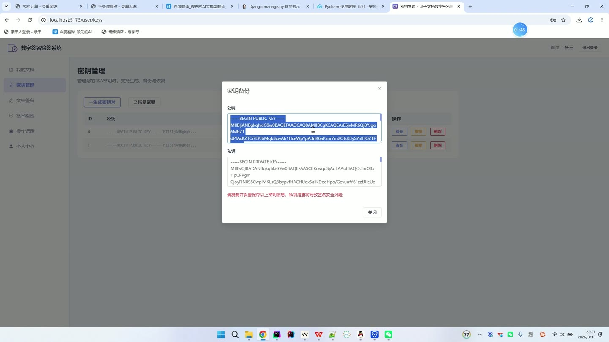
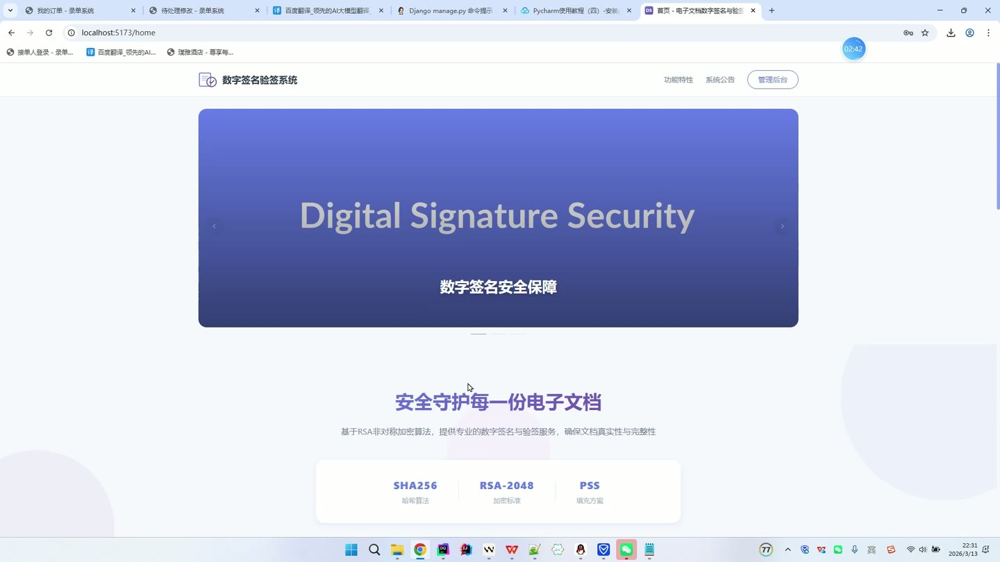

# (附文档)Python+Django+Vue3 电子文档数字签名与验签系统

**技术栈**：Python、Django、Vue3、MySQL

### 系统简介

本系统是一套基于 RSA 非对称加密算法的电子文档数字签名与验签平台，采用前后端分离架构，后端提供 REST 接口，前端为单页应用。系统面向普通用户与管理员两类角色，覆盖文档上传、密钥生成、数字签名、签名验签、记录审计与系统维护全流程。
 
### 核心功能
 
### 普通用户端

 
- 账号注册：填写用户名、密码、昵称、邮箱、手机号完成注册，用户名唯一校验。 
- 账号登录：使用用户名与密码登录，校验账号状态，禁用账号无法登录。 
- 个人资料管理：查看与修改昵称、邮箱、手机号，支持修改登录密码。 
- 密钥生成：按指定密钥长度生成 RSA 密钥对，公钥与加密私钥入库保存。 
- 密钥列表：分页查看本人密钥，展示密钥长度、状态与创建时间。 
- 密钥详情：查看公钥与私钥内容，支持修改密钥状态或删除密钥。 
- 密钥备份：导出指定密钥的公钥、私钥与密钥长度信息用于备份。 
- 密钥恢复：提交公钥、私钥与密钥长度，重新写入生成一条可用密钥。 
- 文档上传：上传 PDF、Word 格式文档，自动计算文件哈希并记录文件大小与类型。 
- 文档列表：分页查看本人文档，支持按文件名关键字检索。 
- 文档下载：下载本人上传的原始文档文件。 
- 文档删除：对文档执行逻辑删除，删除后不在列表中展示。 
- 文档签名：选择本人有效密钥对指定文档进行 SHA256withRSA 签名，生成签名数据与签名副本文件。 
- 签名记录：分页查看本人签名记录，含签名算法、签名数据与签名时间。 
- 签名验签：对指定签名记录发起验签，读取原始文档校验签名有效性与文档完整性。 
- 上传验签：上传文档文件进行独立验签操作并生成验签记录。 
- 验签记录：分页查看本人验签历史，含验证结果与结果详情。 
- 个人统计：查看本人文档数、密钥数、签名数与验签数等统计数据。 
- 公告查看：浏览系统公告列表与公告详情，置顶公告优先展示。
 
### 管理员端

 
- 用户管理：分页查看用户列表，支持按用户名或昵称关键字、角色筛选。 
- 用户编辑：修改用户昵称、邮箱、手机号、角色与状态，可重置用户密码。 
- 用户删除：删除指定用户账号。 
- 文档审计：查看系统内全部文档，支持按文件名搜索，展示上传者、类型、大小与 SHA256 哈希。 
- 签名记录审计：查看所有用户的签名记录，含签名者、文档名称、签名算法与签名状态。 
- 密钥监控：查看全部用户密钥列表，展示所属用户、公钥、密钥长度与状态。 
- 密钥撤销：对正常状态的密钥执行撤销操作，撤销后不可再用于签名。 
- 公告管理：发布、编辑、删除公告，设置标题、内容、置顶、范围与发布状态。 
- 公告上下架：一键切换公告的发布与下架状态。 
- 轮播图管理：新增、编辑、删除首页轮播图，设置标题、图片、跳转链接与排序。 
- 轮播图状态与时效：设置轮播图启用或禁用，配置开始时间与结束时间。 
- 图片上传：上传本地图片作为轮播图资源。 
- 数据统计看板：查看系统整体仪表盘统计数据。 
- 系统备份：创建系统数据备份并查看备份列表。 
- 备份下载：下载指定备份文件。 
- 系统更新与清理：执行系统库更新与数据清理操作。
 
### 技术栈

 后端框架Python + Django 接口风格Django 视图函数 REST 接口，JSON 统一响应结构 ORMDjango ORM 模型层 权限与认证基于角色的路由守卫与登录态校验 加密算法RSA 非对称加密、SHA256withRSA 签名、PSS 填充 前端框架Vue3 + Element Plus 前端路由Vue Router，含公共路由与管理员路由守卫 状态管理Pinia 用户状态存储 构建工具Vite 数据库MySQL 数据表sys_user、user_key、document、signature_record、verify_record、announcement、carousel
 
### 交付内容

 
- 后端完整源码 
- 前端完整源码 
- 数据库初始化脚本 
- 万字文档

## 界面展示

---

## 获取完整源码 + 万字文档

本仓库为项目介绍页。**完整前后端源码、数据库初始化脚本、万字项目文档**，请加微信 `kangkangcode`，或访问 [codekk.top](http://codekk.top) 获取。

可作课程设计 / 毕业设计参考，支持远程部署调试。